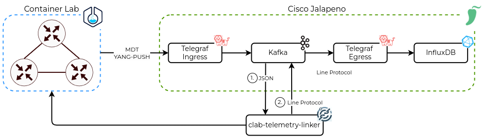

<h1 align="center">containerlab telemetry linker</h1>
<p align="center">
    <br>
    
    
    
    
    
</p>

<p align="center">
</p>

---

## Overview


The Cisco IOS-XRd devices deployed with containeralb transmit telemetry data (Cisco MDT / YANG PUSH) to Telegraf Ingress. The messages are then converted into JSON format and forwarded to Kafka, where they become available in the receiver topic for the clab-telemetry-linker. The data is then processed with the applied impairment values.
After processing, the data is converted into Influx Line Protocol and sent to Kafka Publisher Topic. From there, each message is taken by Telegraf Egress and added to the InfluxDB.
The following impairments can be linked:
- delay
- jitter (delay variation)
- packet loss
- bandwidth / rate

## Start the service
### Overview
The `start` command is used to initiate the clab-telemetry-linker tool. This tool listens for telemetry data, enriches it with container lab impairments, and forwards it to a Kafka broker. Upon starting, the tool initiates several threads responsible for different threads:
1. Consumer - consumes the messages from the receiver topic
2. Processor - processes the messages according to the config (applied impairments)
3. Publisher - publishes the messages to the publisher-topic

### Command Syntax
```
sudo clab-telemetry-linker start -b <kafka-host>:<port> -r <receiver-topic> -p <publisher-topic> 
```
- `--broker <kafka-host:port>` or `-b <kafka-host>:<port>`: Specifies the Kafka broker host and port.
- `--receiver-topic <receiver-topic>` or `-r <receiver-topic>`: Designates the Kafka topic to receive unprocessed telemetry data.
- `--publisher-topic <publisher-topic>` or `-p <publisher-topic>`: Indicates the Kafka topic for publishing processed telemetry data.
### Example
To start the service with Kafka broker at 172.16.19.77:9094, receiving data from hawkv6.telemetry.unprocessed, and publishing to hawkv6.telemetry.processed:
```
sudo clab-telemetry-linker start -b 172.16.19.77:9094 -r hawkv6.telemetry.unprocessed -p hawkv6.telemetry.processed
INFO[2024-01-21T11:31:19Z] Read config file:  /home/ins/.clab-telemetry-linker/config.yaml  subsystem=config
INFO[2024-01-21T11:31:19Z] Start all services                            subsystem=service
INFO[2024-01-21T11:31:19Z] Start consuming messages from broker 172.16.19.77:9094 and topic hawkv6.telemetry.unprocessed  subsystem=consumer
INFO[2024-01-21T11:31:19Z] Starting processing messages                  subsystem=processor
INFO[2024-01-21T11:31:19Z] Starting publishing messages to broker 172.16.19.77:9094 and topic hawkv6.telemetry.processed  subsystem=publisher

^CINFO[2024-01-21T11:31:24Z] Received interrupt signal, shutting down      subsystem=cmd
INFO[2024-01-21T11:31:24Z] Stopping all services                         subsystem=service
INFO[2024-01-21T11:31:24Z] Stop consumer with values:  172.16.19.77:9094 hawkv6.telemetry.unprocessed  subsystem=consumer
INFO[2024-01-21T11:31:24Z] Stopping processor                            subsystem=processor
INFO[2024-01-21T11:31:24Z] Stopping publisher with broker  172.16.19.77:9094  and topic  hawkv6.telemetry.processed  subsystem=publisher
```

## Set impairments
### Overview
The `set` command allows you to configure or overwrite network impairments on specific interfaces of a ContainerLab node. These impairments include delay, jitter, packet loss, and bandwidth rate limitation.
### Command Syntax
```
sudo clab-telemetry-linker set -n <clab-node> -i <interface-name> --delay <value in ms> --jitter <value in ms>  --loss <value in %> --rate <value in kbit/s>
```
- `--node <clab-node>` or `-n <clab-node>`: Specify the ContainerLab node name.
- `--interface <interface-name>` or`-i <interface-name>`: Designate the interface on the node to set impairments.
- `--delay <value in ms>`or `-d <value in ms>`: Set the delay time in milliseconds.
- `--jitter <value in ms>` or `-j <value in ms>`: Set the jitter value in milliseconds.
- `--loss <value in %>` or `-l <value in %>`: Define the packet loss percentage.
- `--rate <value in kbit/s>` or `-r <value in kbit/s>`: Limit the bandwidth rate in kilobits per second.


### Example
To set a delay of 1ms, jitter of 1ms, packet loss of 5%, and a rate limit of 100000 kbit/s on interface Gi0-0-0-0 of node XR-1:
```
sudo clab-telemetry-linker set -n XR-1 -i Gi0-0-0-0 --delay 1ms --jitter 1ms --loss 5 --rate 100000 
-----------+-------+--------+-------------+-------------+
| Interface | Delay | Jitter | Packet Loss | Rate (kbit) |
+-----------+-------+--------+-------------+-------------+
| Gi0-0-0-0 | 1ms   | 1ms    | 5.00%       |      100000 |
+-----------+-------+--------+-------------+-------------+
```

## Show
### Overview
The `show` command is used to display the current network impairments applied to a specific ContainerLab node. This command provides a detailed view of the network settings, including delay, jitter, packet loss, and bandwidth rate for each interface.

Command Syntax
```
sudo clab-telemetry-linker show -n <clab-node>
```
- `--node <clab-node>` or  `n <clab-node>`: Specifies the ContainerLab node name for which you want to view the impairments.
### Example
To display the network impairments for the node XR-1:
```
sudo clab-telemetry-linker show -n XR-1
+-----------+-------+--------+-------------+-------------+
| Interface | Delay | Jitter | Packet Loss | Rate (kbit) |
+-----------+-------+--------+-------------+-------------+
| lo        | N/A   | N/A    | N/A         | N/A         |
| eth0      | N/A   | N/A    | N/A         | N/A         |
| Gi0-0-0-0 | 0s    | 0s     | 0.00%       |           0 |
| Gi0-0-0-1 | 4ms   | 0s     | 0.00%       |           0 |
| Gi0-0-0-2 | 6ms   | 0s     | 5.00%       |           0 |
+-----------+-------+--------+-------------+-------------+
```


## Delete
### Overview
The delete command is used to remove network impairments from a specific interface on a ContainerLab node. This action resets the network settings for the specified interface to their default state, which typically means no delay, jitter, packet loss, or rate limitation.

### Command Syntax
```
clab-telemetry-linker delete -n <clab-node> -i <interface-name>
```
- `--node <clab-node>` or `-n <clab-node>`: Specifies the ContainerLab node name.
- `--interface <interface-name>` or `-i <interface-name>`: Designates the specific interface on the node from which to delete impairments.
### Examples
To delete impairments from interface Gi0-0-0-0 on node XR-1:
```
clab-telemetry-linker delete -n XR-1 -i Gi0-0-0-0
+-----------+-------+--------+-------------+-------------+
| Interface | Delay | Jitter | Packet Loss | Rate (kbit) |
+-----------+-------+--------+-------------+-------------+
| Gi0-0-0-0 | 0ms   | 0s     | 0.00%       |           0 |
+-----------+-------+--------+-------------+-------------+
```

## Additional Info
- clab-telemetry-linker will forward the impairments to the specific containerlab command (https://containerlab.dev/cmd/tools/netem/set/)
- The default containerlab prefix is: "clab-hawkv6" (can be changed in config file)
- The following models are used:
```
sensor-group delay
  sensor-path Cisco-IOS-XR-perf-meas-oper:performance-measurement/nodes/node/interfaces/interface-details/interface-detail/delay-measurement-session/last-advertisement-information/advertised-values
 !
 sensor-group bandwidth
  sensor-path Cisco-IOS-XR-clns-isis-oper:isis/instances/instance/interfaces/interface/interface-status-and-data/enabled/bandwidth
 !
 sensor-group packet-loss
  sensor-path Cisco-IOS-XR-clns-isis-oper:isis/instances/instance/interfaces/interface/interface-status-and-data/enabled/packet-loss-percentage
 !
 sensor-group utilization
  sensor-path openconfig-interfaces:interfaces/interface/state/counters/in-octets
  sensor-path openconfig-interfaces:interfaces/interface/state/counters/out-octets
 !
```
- Detailed network configs can be found in https://github.com/hawkv6/network/tree/hawk9-clab-testnetwork/config
- Example telemetry messages can be found in the `examples` folder
